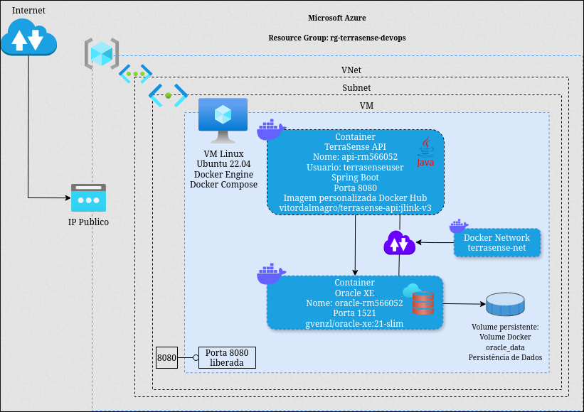

# TerraSense

O TerraSense é uma plataforma de monitoramento agrícola inteligente desenvolvida para auxiliar produtores rurais na gestão de propriedades, plantações e condições ambientais.

A solução centraliza informações provenientes de sensores IoT, dados climáticos e dados de satélite da NASA, permitindo o acompanhamento das condições das plantações e a geração de alertas agrícolas para apoio à tomada de decisão.

A API TerraSense atua como camada central da solução, disponibilizando operações de cadastro, consulta, atualização e remoção de dados relacionados aos usuários, propriedades rurais, plantações, dados climáticos e alertas agrícolas.

Para a disciplina DevOps Tools & Cloud Computing, a solução foi conteinerizada utilizando Docker, Docker Compose e Oracle Database, com deploy em uma VM na Microsoft Azure através de automação com Azure CLI.


---

# Integrantes

| Nome                          | RM       | Turma |
| ----------------------------- | -------- | ----- |
| Agatha Yie Won Yun            | RM561507 | 2TDSA |
| Ana Claudia Fernandes Martins | RM561190 | 2TDSR |
| Andre Rosa Colombo            | RM563112 | 2TDSA |
| Samantha Faruolo Galdi        | RM554794 | 2TDSA |
| Vitor Fria Dalmagro           | RM566052 | 2TDSA |

---

# Arquitetura da Solução



A solução foi implantada em uma Máquina Virtual Linux Ubuntu 22.04 na Microsoft Azure.

A infraestrutura é composta por:

- Container da API Spring Boot (`api-rm566052`);
- Container Oracle XE (`oracle-rm566052`);
- Rede Docker dedicada (`terrasense-net`);
- Volume nomeado Docker (`oracle_data`);
- Imagem personalizada publicada no Docker Hub;
- Provisionamento automatizado utilizando Azure CLI.

---

# Containerização

## Container da Aplicação

Características:

- Dockerfile Multi-Stage;
- Runtime Java customizado com JLink;
- Usuário não privilegiado (`terrasenseuser`);
- Diretório de trabalho `/app`;
- Porta 8080 exposta;
- Imagem publicada no Docker Hub.

Imagem utilizada:

docker.io/vitordalmagro/terrasense-api:jlink-v3

---

# Docker Compose

O Docker Compose realiza a orquestração dos containers da aplicação.

Containers:

- api-rm566052 (Spring Boot API)
- oracle-rm566052 (Oracle XE Database)

Recursos implementados:

- Volume nomeado para persistência (`oracle_data`);
- Rede Docker dedicada (`terrasense-net`);
- Variáveis de ambiente para conexão com banco;
- Execução em segundo plano;
- Comunicação entre containers pela mesma rede.
---

# Como Executar Localmente

### 1: Clone do Repositório
```bash
git clone https://github.com/TerraSense-GS/TerraSense_DevOps.git
```
### 2: Acesse a pasta
```bash
cd TerraSense_DevOps
```
### 3: Execute os containers
```bash
docker compose up -d
```
### 4: Verifique os containers
```bash
docker ps
```

### 5: Acesse o Swagger

```text
http://localhost:8080/swagger-ui.html
```
---

# Como Executar na Azure

### 1: Clone do Repositório
```bash
git clone https://github.com/TerraSense-GS/TerraSense_DevOps.git
```
### 2: Acesse a pasta
```bash
cd TerraSense_DevOps
```
### 3: Login Azure
```bash
az login
```
## 4: Executar provisionamento
```bash
chmod +x azure/criar-infra.sh
```
```bash
./azure/criar-infra.sh
```

## 5: Acessar Swagger

```text
http://IP_PUBLICO:8080/swagger-ui.html
```

# Links do Projeto

- Docker Hub: https://hub.docker.com/repository/docker/vitordalmagro/terrasense-api
- Vídeo Demonstrativo: https://youtu.be/MQc8wK1yJRo
---
# Disciplina

DevOps Tools & Cloud Computing — Global Solution

FIAP
